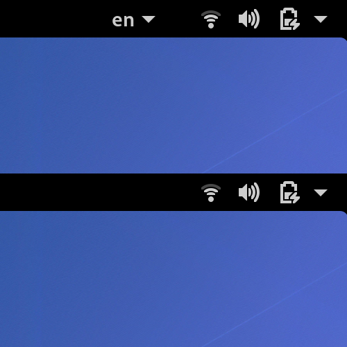

# Hide Keyboard Layout

GNOME Shell extension to hide keyboard layout indicator in status bar.

## Install

1. Open [Hide Keyboard Layout] on GNOME Shell Extensions site.
2. Click slider to install extension.

[Hide Keyboard Layout]: https://extensions.gnome.org/extension/2848/hide-keyboard-layout/
